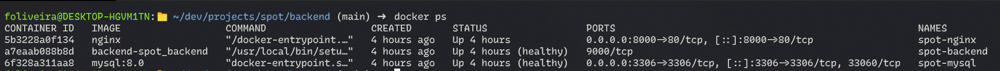
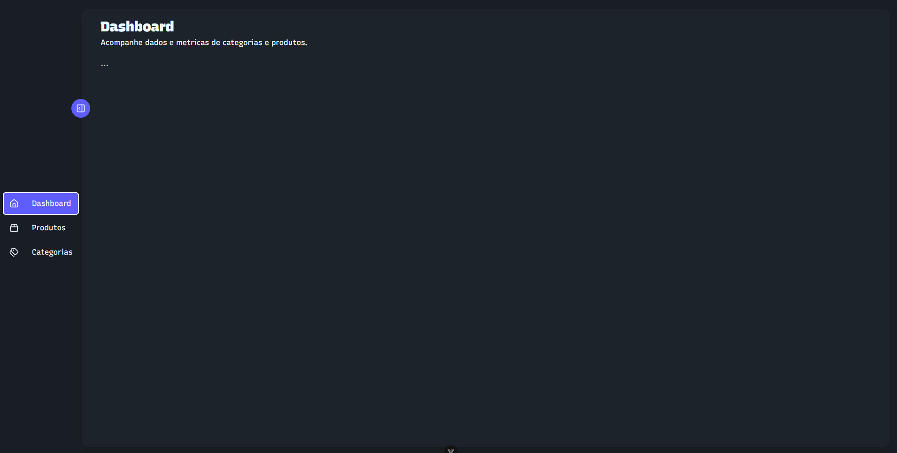
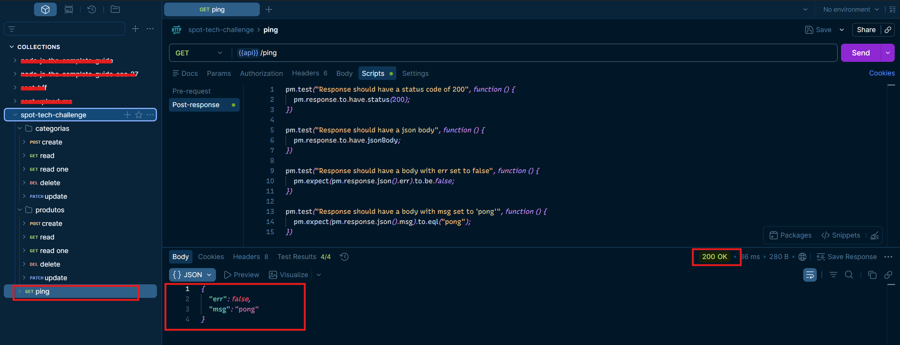
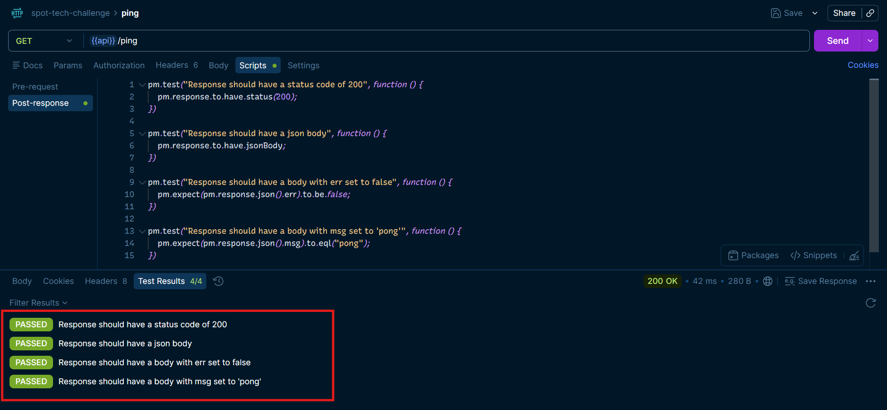
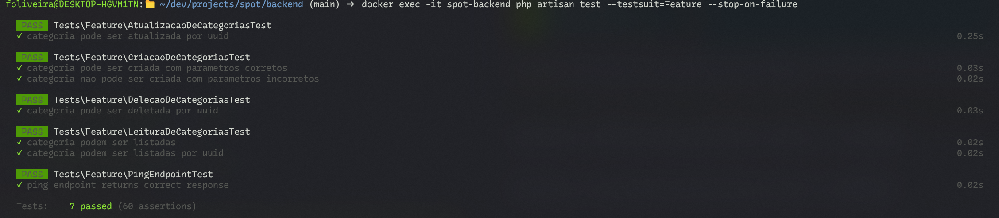
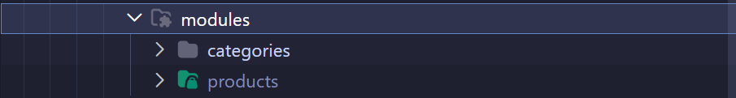

# Tech challenge
Desafio técnico proposto pela [spotpromo](https://spotpromo.com.br).

# Proposta do desafio:
O candidato deve criar 2 telas, para cadastro e gerenciamento de produtos com categorias.

## Tela 1
Uma tela para `CRUD` de categorias, sendo necessários os campos:
- `id` (identificador único da categoria)
- `descricao` (descrição da categoria)
- `status` (para controlar a disponibilidade do uso da categoria)

## Tela 2
Tela para `CRUD` de produtos com suas respectivas categorias, sendo necessários os campos:
- `id` (identificador único do produto)
- `descricao` (descrição do produto)
- `categoria_id` (ligação de uma categoria ao produto)

*Não é necessário tela de login para uso dos CRUDs.*

## Requisitos funcionais:
- Banco de dados SQLServer ou MySQL
- BackEnd com PHP
- FrontEnd com HTML5, CSS3 e JavaScript


# Como subir esse projeto na sua máquina
Esse projeto foi pensado para ter um setup fácil e rápido. Para que isso fosse possível, pensei em Docker. Docker e docker-compose são excelentes ferramentas para subir ambientes com pouco esforço e trabalho manual.

Se você tiver Docker e docker-compose instalados em sua máquina, colocar esse projeto em funcionamento será tão simples quanto executar:
```sh
cd backend
docker compose up -d --build
```

O resultado disso deve ser 3 containers em funcionamento:
- spot-nginx (`0.0.0.0:8000->80/tcp,`)
- spot-backend (`9000/tcp` para php-fpm)
- spot-mysql (`0.0.0.0:3306->3306/tcp`)



As credenciais do usuário do bando de dados você encontra em `backend/docker/containers/mysql/env/.env.dev`.

Para comodidade elas já estão parametrizadas no `.env.example` do Laravel, então quando o container subir e copiar esse arquivo para `.env` é esperado que tudo funcione corretamente:

```env
DB_CONNECTION=mysql
DB_HOST=spot_mysql
DB_PORT=3306
DB_DATABASE=app
DB_USERNAME=root
DB_PASSWORD=spot
```

Caso você não tenha Docker/docker-compose instalados, o processo será um pouco mais manual mas ainda é possível. Você deve garantir que:
- Tem um MySQL acessível em seu localhost
- Tem PHP instalado e Composer configurado
- As configurações no `.env` apontam corretamente para o MySQL da sua máquina
- As migrations foram executadas

> No setup manual será necessário ir vendo os erros de ambiente que acontecem e ir corrigindo, uma vez que apenas você sabe o que tem instalado na sua máquina e quais portas e quais hosts estão parametrizados.

Para o FrontEnd não foi feito nenhum setup com Docker pois gerenciar projetos de frontend é muito mais simples, uma vez que apenas o Node e NPM são necessários (o NPM vem junto com o Node).

Para colocar o FrontEnd em funcionamento:
```sh
cd frontend
npm install
npm run dev
```

Isso deve criar um servidor de desenvolvimento em `localhost:5173` mas tenha certeza de qual porta foi levantado esse servidor olhando o output desse comando.

> Caso o seu `backend` esteja em outra porta que não seja a `8000`, por favor considere mudar o endereço para onde o frontend busca os dados. Faça isso no arquivo `frontend/src/services/http.ts`.

O resultado esperado é que a aplicação possa estar visivel no endereço mencionado anteriormente. Você deve ver o seguinte:


Fique á vontade para navegar nos Menus de Categorias e Produtos para criar novos registros.

# Testes de API

Na raiz desse repositório você consegue encontrar a collection postman para testar somente o funcionamento da API. Como healthcheck existe um endpoint `/api/ping` que você pode usar para validar o funcionamento da API.



Deixei alguns testes post-response como demonstração de que podemos usar o postman para aplicar alguns testes na API.



Também deixei alguns testes da API de categorias para fins de demonstração e aplicabilidade do TDD. Os testes estão em `tests/Feature`. Para executa-los, você pode executar de fora do container:
```sh
docker exec -it spot-backend php artisan test --testsuit=Feature --stop-on-failure
```

O resultado deve ser algo parecido com o seguinte:


# Decisões técnicas/arquiteturais sobre o BackEnd
Dependendo do tamanho da aplicação, um simples MVC cabe muito bem. As vezes um MVC com adição de service layer e repository layer. Eu particularmente gosto da abordagem de clean architecture mas para esse projeto eu preferi usar [Feature Based Architecture](https://medium.com/@viniciusvibrich/feature-based-estrutura-escal%C3%A1vel-para-projetos-complexos-505448ec86c1) com service e repository layers. É possível notar essa organização em `backend/application/app/Features`.

[niveis-de-maturidade-de-uma-api-rest](https://www.programmers.com.br/blog/niveis-de-maturidade-de-uma-api-rest/).

A api por ser simples e para fins demonstrativos, chega ao nivel 2 da [Richardson Maturity Model](https://martinfowler.com/articles/richardsonMaturityModel.html).

# Decisões técnicas/arquiteturais sobre o FrontEnd
Usei o [vite](https://vite.dev/) para criar um projeto VueJs (TypeScript) e usufruir da nova [api de composição](https://vuejs.org/guide/extras/composition-api-faq) e a abordagem de [composables](https://vuejs.org/guide/reusability/composables) para deixar o FrontEnd dinâmico e com uma boa UX. Fiz uso de bibliotecas como [daisyui](https://daisyui.com/), [vue-hot-toast](https://github.com/SteveYuOWO/vue-hot-toast) para criar uma UI atraente e moderna. Não fiz com intenção de impressionar pois eu entendo que isso não dá pontos, na verdade esse é meu padrão de desenvolvimento. Eu naturalmente foco na melhor construção possível e que agrade a todos. Utilizei o [axios](https://axios-http.com/docs/intro) para comunicação com o BackEnd.

Frameworks como React, Angular, e etc são ferramentas poderosas também, mas o VueJs tem na minha opnião a API (forma de usar) mais simples, declarativa e de baixa curva de aprendizado. Podemos continuar usando o bom e velho HTML para fazer nossas marcações ao invés do JSX (o que naturalmente faz você ter que aprender um novo conceito, ainda que simples).

Para finalizar, continuei usando a [Feature Based Architecture](https://medium.com/@viniciusvibrich/feature-based-estrutura-escal%C3%A1vel-para-projetos-complexos-505448ec86c1) par organizar o FrontEnd:


Você encontra essa organização e `frontend/src/pages/app/modules`. Há outras orgnaizações como `layouts`, `services`, `routes` e etc.

# Network

<a href="https://www.linkedin.com/in/felipeoli7eira" target="blank">
    
</a>

<a href="https://instagram.com/oli7eirafelipe" target="blank">
    
</a>

# Felipe Oliveira - Desenvolvedor full stack


